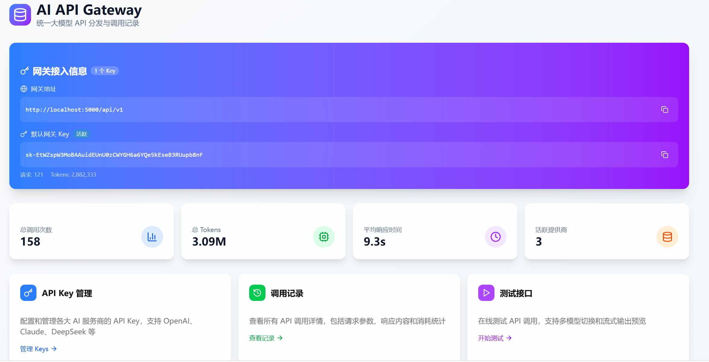
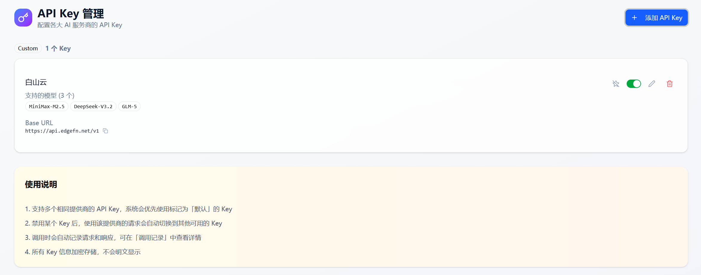
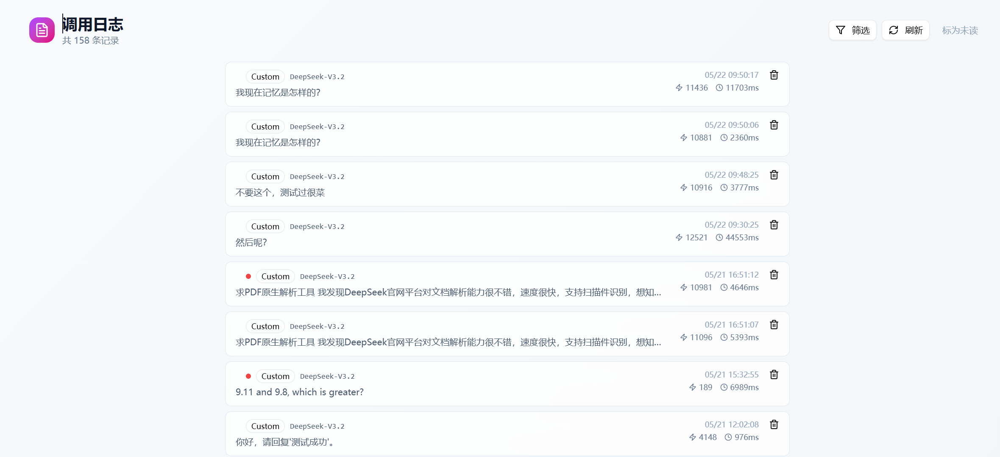
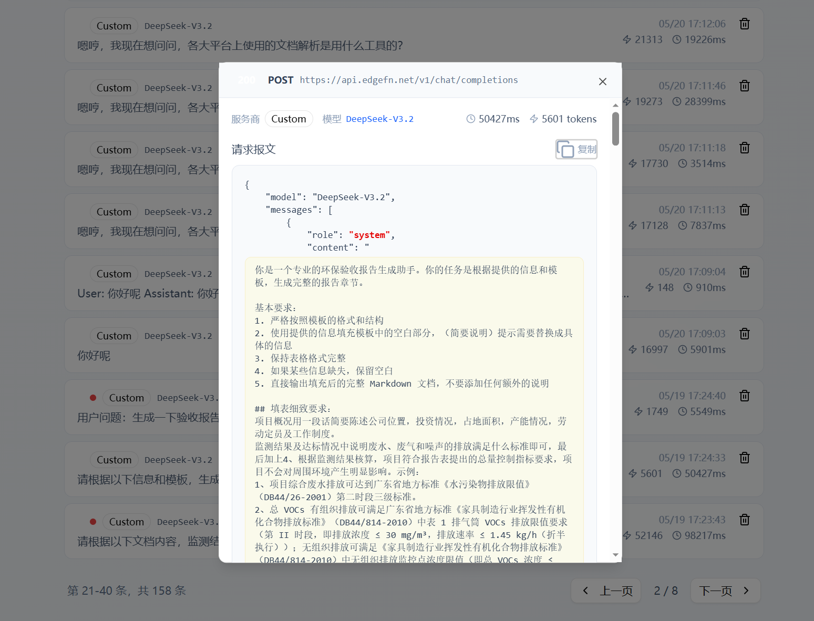

# AI API Gateway

> 统一大模型 API 分发与调用记录系统，一个端点对接多家 AI 服务商，完整记录每次调用。



## ✨ 特性

- 🔑 **统一 API Key 管理** — 集中管理 OpenAI、Claude、DeepSeek、智谱、月之暗面等多家服务商
- 🔀 **智能路由分发** — 根据模型自动选择合适的服务商
- 🔌 **服务商适配器** — 自动适配非 OpenAI 格式（如 Claude），调用方无感知
- 🌊 **流式响应合并** — 服务端流式返回时自动合并为完整响应，token 统计准确
- 📊 **完整调用日志** — 请求/响应、tokens、耗时、错误一一记录
- 🔍 **富文本日志查看** — JSON 嵌套字段递归解析，长文本块和 XML tag 高亮渲染
- 📈 **统计分析** — 调用次数、Token 消耗、平均耗时一目了然
- 💾 **本地 SQLite** — 零配置、单文件，开箱即用
- 🎨 **现代化 UI** — 基于 shadcn/ui + Tailwind CSS 4

## 🖼️ 界面预览

### API Key 管理
集中配置多家 AI 服务商的 API Key，支持启用/禁用、默认 Key 切换、批量模型配置。



### 调用日志列表
所有 API 调用一目了然，未读自动标红点，支持按服务商/模型筛选，hover 显示删除按钮。



### 调用日志详情
弹窗显示完整请求/响应报文，自动解析嵌套 JSON 字符串，对 `text` / `content` 字段做富文本渲染（换行、XML tag 高亮、role 角色着色）。



## 🚀 快速开始

### 前置要求

- Node.js 22+
- pnpm 9+

### 安装与启动

```bash
# 1. 安装依赖
pnpm install

# 2. 初始化数据库
pnpm tsx scripts/init-db.ts

# 3. 启动开发服务器
pnpm run dev
```

服务启动在 http://localhost:5000

> � **Windows 用户**：脚本提供 PowerShell 版本，会自动检查并释放被占用的 5000 端口。详见 `scripts/dev.ps1` / `scripts/build.ps1` / `scripts/start.ps1`。

### 第一次使用

1. 访问 `/keys` → 添加你的 API Key（名称、服务商、Base URL、Key、模型）
2. 访问 `/test` → 选择 Key 发送测试消息
3. 访问 `/logs` → 查看刚才的调用记录
4. 访问 `/` → 查看汇总统计

## 🔌 核心 API

### 1. 统一聊天接口

**POST** `/api/v1/chat/completions` — OpenAI 兼容格式，自动路由到对应服务商。

```bash
curl -X POST http://localhost:5000/api/v1/chat/completions \
  -H "Content-Type: application/json" \
  -d '{
    "model": "gpt-4o-mini",
    "messages": [{"role": "user", "content": "Hello"}]
  }'
```

### 2. API Key 管理

| 方法 | 路径 | 说明 |
|------|------|------|
| GET | `/api/keys` | 获取所有 Key |
| POST | `/api/keys` | 创建新 Key |
| PUT | `/api/keys` | 更新 Key |
| DELETE | `/api/keys?id=xxx` | 删除 Key |

### 3. 调用日志

| 方法 | 路径 | 说明 |
|------|------|------|
| GET | `/api/logs` | 日志列表（支持分页、按服务商/模型筛选） |
| GET | `/api/logs?action=filters` | 获取筛选选项 |
| DELETE | `/api/logs?id=xxx` | 删除指定日志 |

### 4. 统计数据

**GET** `/api/stats` — 调用次数、Token 使用、平均耗时等汇总。

## 🎯 支持的服务商

### OpenAI 兼容（直接对接）

- **OpenAI** — GPT-4o、GPT-4 Turbo、O1 系列
- **DeepSeek** — DeepSeek Chat / Coder
- **零一万物 Yi** — Yi Large / Medium
- **Mistral AI** — Mistral Large、Codestral
- **Groq** — Llama 3.1、Mixtral、Gemma2
- **月之暗面 Moonshot** — Moonshot V1 系列
- **阿里云通义千问** — Qwen 系列

### 自动适配（自定义格式）

- **Anthropic Claude** ⚡ — 自动转换消息格式、提取 system 消息、统一响应结构
- **智谱 GLM** ⚡ — 处理 API 细微差异、统一 token 计数

### 自定义

支持任何 OpenAI 兼容的 API 端点，配置 Base URL 即可。

## 🌊 流式响应自动合并

当客户端请求 `stream: false` 但上游服务商只返回 SSE 流时，网关会自动：

1. 解析所有 `data:` 数据块
2. 拼接 `delta.content` 为完整文本
3. 提取最终的 `usage` 信息
4. 返回标准的非流式 JSON 响应

```jsonc
// 客户端请求
{ "model": "gpt-4o-mini", "messages": [...], "stream": false }

// 上游 SSE：
// data: {"choices":[{"delta":{"content":"有"}}]}
// data: {"choices":[{"delta":{"content":"一天"}}]}
// data: [DONE]

// 网关返回（自动合并）：
{
  "choices": [{ "message": { "content": "有一天..." } }],
  "usage": { "prompt_tokens": 5, "completion_tokens": 10, "total_tokens": 15 }
}
```

## 🗄️ 数据库

SQLite 数据库文件位于 `data/api-gateway.db`，使用 WAL 模式提高并发性能。

### `api_keys` — API Key 配置

| 字段 | 类型 | 说明 |
|------|------|------|
| id | TEXT | UUID 主键 |
| name | TEXT | Key 名称 |
| provider | TEXT | 服务商标识 |
| base_url | TEXT | API 地址 |
| api_key | TEXT | 服务商 API Key |
| models | TEXT | 支持的模型列表（JSON 数组） |
| is_active | INTEGER | 是否启用 |
| is_default | INTEGER | 是否为该服务商的默认 Key |
| created_at / updated_at | INTEGER | 时间戳 |

### `api_call_logs` — 调用日志

| 字段 | 类型 | 说明 |
|------|------|------|
| id | TEXT | UUID 主键 |
| provider / model | TEXT | 服务商 / 模型 |
| api_key_id | TEXT | 关联的 Key ID |
| endpoint / request_method | TEXT | 端点 / 方法 |
| request_headers / request_body | TEXT | 请求头 / 请求体（JSON） |
| response_status / response_body | INTEGER / TEXT | 响应状态码 / 响应体 |
| request_tokens / response_tokens / total_tokens | INTEGER | Token 计数 |
| duration_ms | INTEGER | 耗时（毫秒） |
| error_message | TEXT | 错误信息 |
| ip_address / user_agent | TEXT | 请求来源 |
| created_at | INTEGER | 时间戳 |

## 📦 技术栈

- **Framework**: Next.js 16 (App Router) + 自定义 HTTP server
- **Runtime**: Node.js 22+
- **Language**: TypeScript 5
- **UI**: React 19 + shadcn/ui + Tailwind CSS 4
- **Database**: SQLite (better-sqlite3) + Drizzle ORM
- **Package Manager**: pnpm 9+

## 📁 项目结构

```
src/
├── app/
│   ├── api/
│   │   ├── v1/chat/completions/   # 统一聊天接口
│   │   ├── keys/                  # API Key 管理
│   │   ├── logs/                  # 调用日志
│   │   └── stats/                 # 统计数据
│   ├── keys/                      # Key 管理页面
│   ├── logs/                      # 日志查看页面
│   ├── test/                      # API 测试页面
│   └── page.tsx                   # 首页仪表盘
├── lib/
│   ├── api-utils.ts               # 数据库操作
│   ├── provider-adapters.ts       # 服务商适配器
│   └── gateway-utils.ts           # 网关工具
├── storage/database/              # 数据库 schema
└── components/ui/                 # shadcn 组件库

data/
└── api-gateway.db                 # SQLite 数据库
```

## 🔧 常用命令

```bash
pnpm run dev          # 开发模式（端口 5000）
pnpm run build        # 构建生产版本
pnpm run start        # 启动生产服务
pnpm run ts-check     # 类型检查
pnpm run lint         # 代码检查
pnpm run validate     # 类型检查 + lint（并行）
pnpm tsx scripts/init-db.ts   # 初始化数据库
```

## 🌐 环境变量

可选的 `.env.local` 配置：

```env
PORT=5000                          # 服务端口
HOSTNAME=localhost                 # 主机
NODE_ENV=development               # 环境
DATABASE_PATH=./data/api-gateway.db   # 数据库文件路径
```

## 📝 维护建议

### 备份数据库

```bash
# Linux / Mac
cp data/api-gateway.db "data/backup-$(date +%Y%m%d).db"
```

```powershell
# Windows
$date = Get-Date -Format "yyyyMMdd"
Copy-Item data/api-gateway.db "data/backup-$date.db"
```

### 清理旧日志

调用日志会持续增长，建议定期清理：

```sql
DELETE FROM api_call_logs WHERE created_at < strftime('%s','now','-30 days') * 1000;
VACUUM;
```

### 性能分析

```sql
-- 各服务商响应时间分布（近 7 天）
SELECT
    provider,
    AVG(duration_ms) AS avg_ms,
    MIN(duration_ms) AS min_ms,
    MAX(duration_ms) AS max_ms,
    COUNT(*) AS calls
FROM api_call_logs
WHERE created_at > strftime('%s','now','-7 days') * 1000
GROUP BY provider;
```

## 🔒 安全建议

- 不要将 `data/api-gateway.db` 提交到版本控制（已在 `.gitignore` 中）
- 生产环境使用 HTTPS 部署
- 在反向代理或网关层添加访问认证
- 定期备份数据库、定期更新依赖

## � 故障排除

**端口被占用**

```powershell
# Windows
Get-NetTCPConnection -LocalPort 5000 | ForEach-Object { Stop-Process -Id $_.OwningProcess -Force }
```

```bash
# Linux / Mac
lsof -ti:5000 | xargs kill -9
```

**Token 统计不准确**：请求 tokens 为估算值，响应 tokens 取自服务商返回，不同服务商口径可能略有差异。

**数据库文件过大**：参考上文「清理旧日志」，执行 `VACUUM` 收缩文件。

## 📚 相关文档

- [QUICKSTART.md](./QUICKSTART.md) — 5 分钟快速上手
- [CHANGELOG.md](./CHANGELOG.md) — 版本更新日志
- [AGENTS.md](./AGENTS.md) — 项目结构与开发规范

## 📄 许可证

MIT License

---

**最后更新**: 2026-05-25
